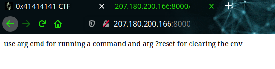
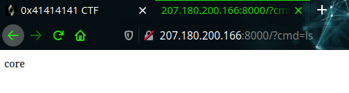
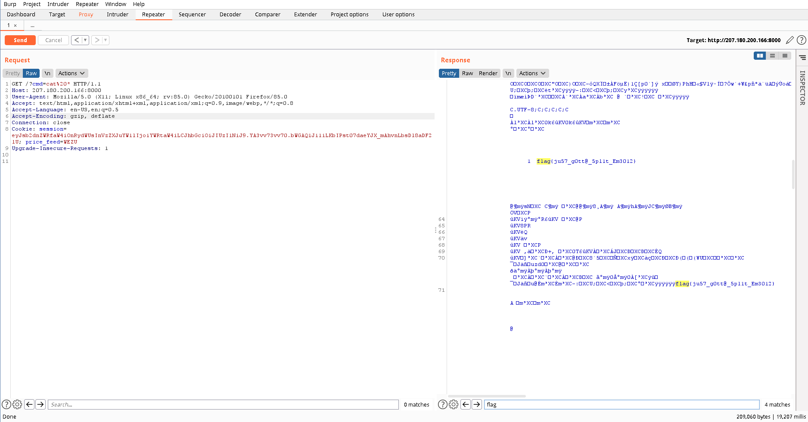

# HACKME - 453 pts

___

### Description

##### can you please just hack me, I will execute all your commands but only 4 chars in length

##### author: pop_eax
___

<br>


From the challenge discription we can say this is related to [COMMAND INJECTION](https://portswigger.net/web-security/os-command-injection) vulnerability.

```Command injection is an attack in which the goal is execution of arbitrary commands on the host operating system via a vulnerable application.```

<br>

Visiting the given URL we land at this page...




So we can pass our commands using `?cmd` argument and to reset the session use
`?reset`

At first i checked which dir im currently in and what are the files are available 



and there was an EXECUTABLE (core) then i just executed `cat *` and got the flag...



***

`flag{ju57_g0tt@_5pllt_Em3012}`

***

But this wasnt the intended way, it was patched afterwards. Stil the admins counted this XD.

***