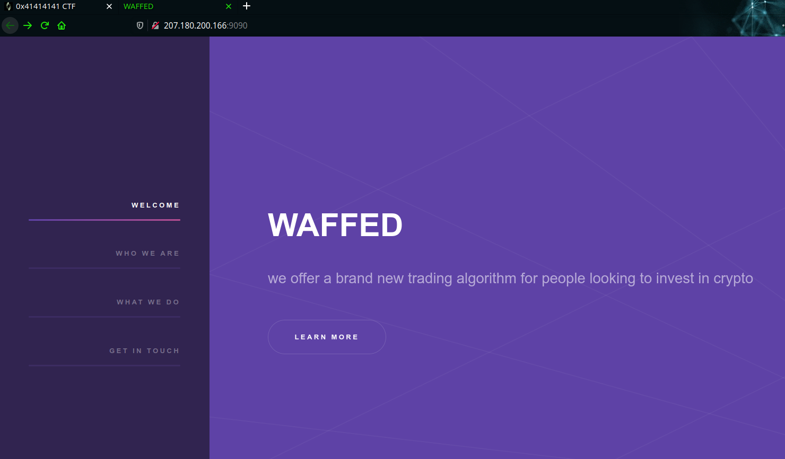
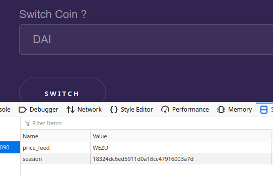
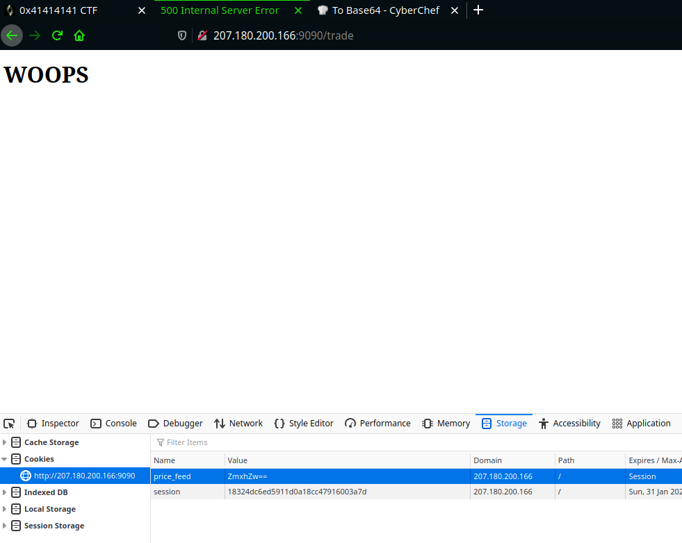
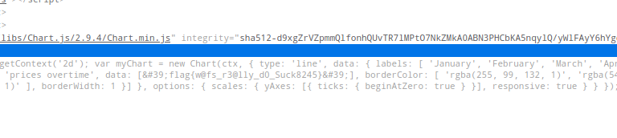

# WAFFED - 496 pts

### Description

<pre>
I am tired of these investing platforms I literally lost all my btc on these platforms. can you hack these dudes and return my funds ?


author: pop_eax
</pre>
<br>

The given link took me to a `http` site, the UI was awesome XD




<br>

clicking `learn more` directed us `/trade` page...
there we can see Graph of some trading algorithms, if u check carefully for each algorithm our COOKIE (price_feed) changes 


<br><br>



<br>

And the cookie is nothing but a base64 encoded values of the coin names.

Always check the source of the webpage... there we found a JavaScript function
<br>

```javascript
function switchCoin() {
    window.location = "/changeFeed/" + document.getElementById("coinlist").value
}
```
<br>

It looks up the name of the coin in the subdirectory `changeFeed`

So why not try to change the value of the cookie `price_feed`

then I encoded `flag.txt` in base64 and added in the cookie field, 
refreshing the webpage returned....




<br>

If the coin doesnt exist we get `WOOPS`

so the flag isnt in that subdirectory, so i encoded `../../../../../../../../flag.txt` in base64 and replaced the value of `price_feed`




<br>

Inspecting the source we get the flag XD

```
flag{w@fs_r3@lly_d0_Suck8245}
```


This is a [Local file inclusion vulnerability](!https://www.acunetix.com/blog/articles/local-file-inclusion-lfi/) 